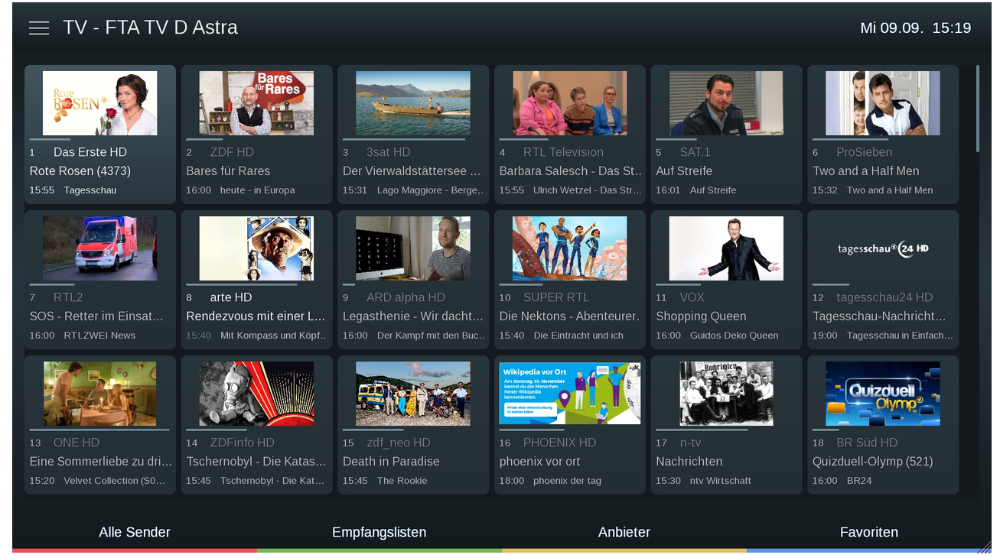
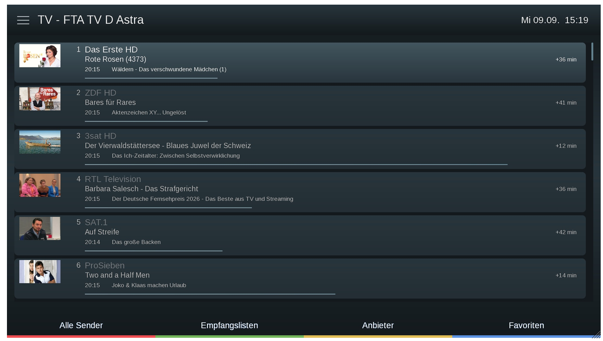
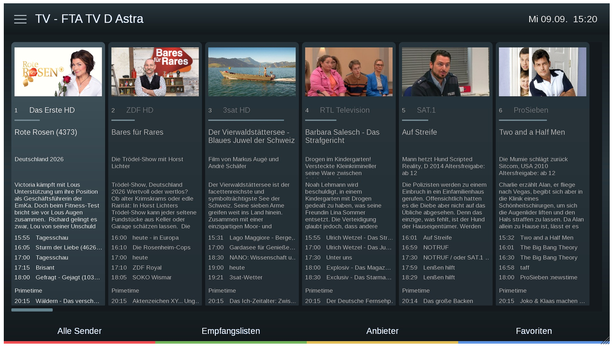
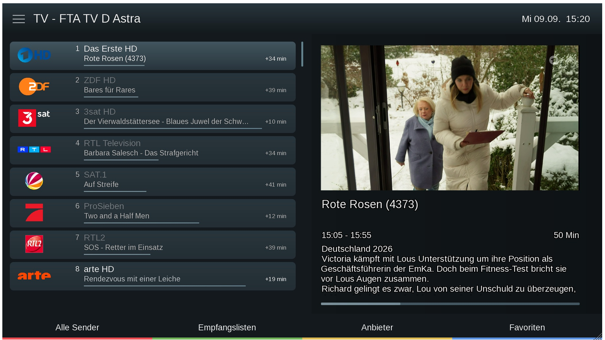
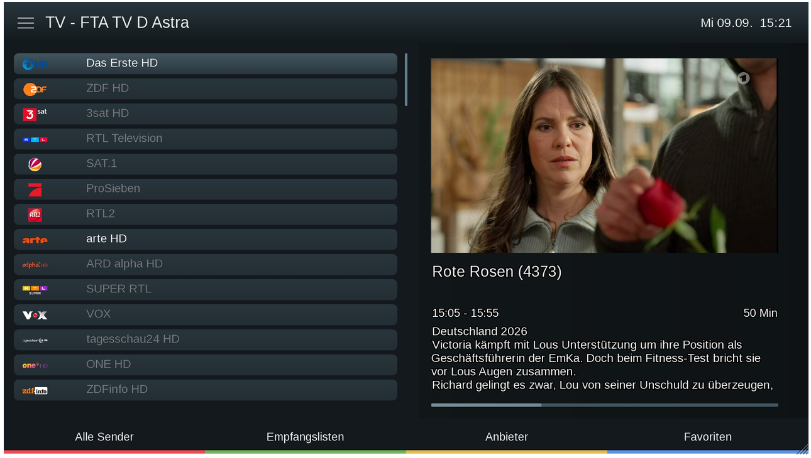
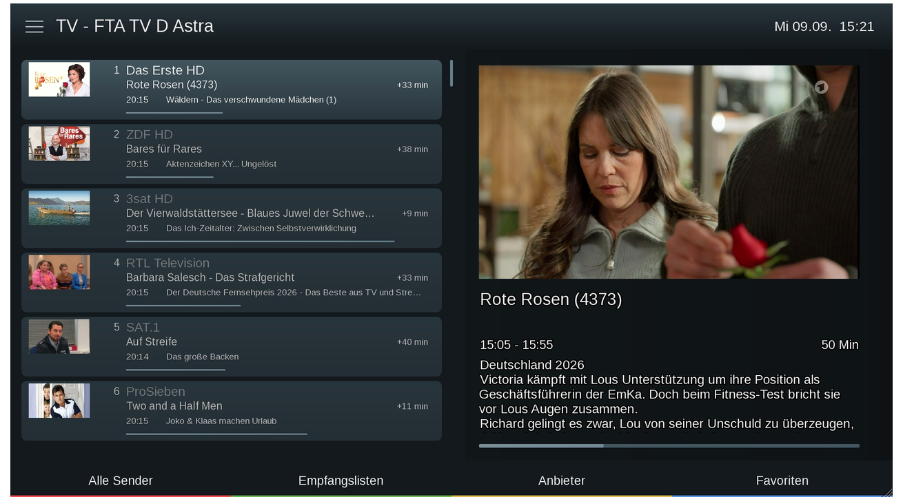
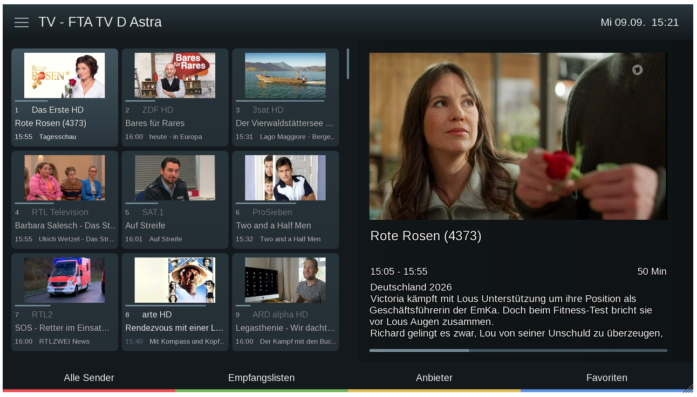
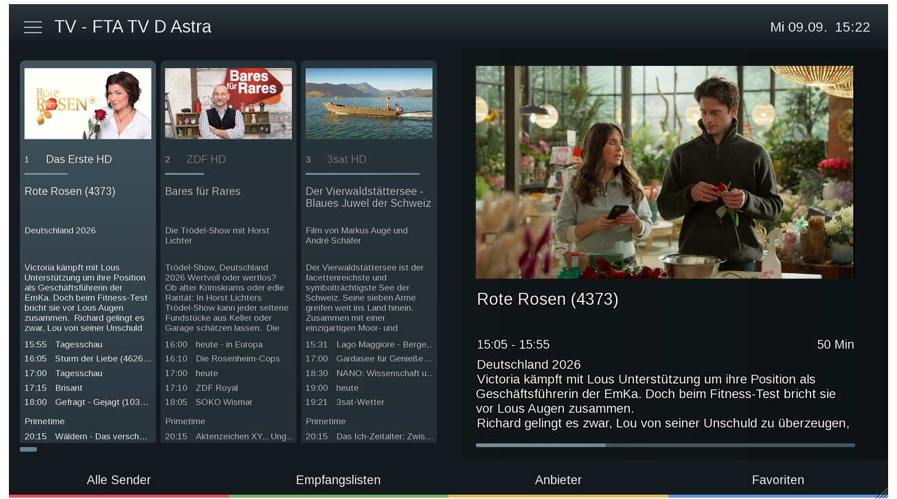

# Umbra

Umbra is a native OpenATV skin with configurable style packs, HD/FHD/WQHD layouts,
icon-font graphics and optional e2MDB artwork. It includes the **Umbra** settings
plugin; no separate settings package is needed.



## User Guide

Read the [OpenATV user guide: Umbra and skins from the feed](https://openatv.github.io/enigma2-doku/en/#umbra-and-skins-from-the-feed)
for installation and everyday use.

## Features

- HD (1280 x 720), FHD (1920 x 1080) and WQHD (2560 x 1440) layouts.
  List density and grid layout depend on the resolution and selected view.
- Graphite, Cinema, Petrol, Clear and Gallery style packs, with individual
  overrides for colours, text size, gradients, transparency and layouts.
- Classic, cover and panorama infobars, active/inactive status icons, optional
  tuner/signal information, encryption information and weather forecasts.
- Channel lists with details, live-TV preview, gallery and column views.
- Native menus, compact dialogs, EPG layouts, recording/timer screens and
  adaptations for plugin screens covered by the MetrixHD reference.
- Shared UI and monochrome weather icon fonts and one spinner set. Required raster assets are shared
  between resolutions; no runtime SVG conversion is added.
- Native OpenATV panels and templates reuse repeated screen elements.
- Optional e2MDB cover, backdrop and preview images. The normal skin remains
  usable without e2MDB; media options require its plugin and converter.

## Requirements

Use a current **OpenATV 8.0 or later** image containing the native keyboard,
EPG controls, native dialog/list icon support and skin reload APIs. This package does not patch Enigma2 or other
plugins and is not intended for other image teams.

The package depends on Enigma2, its system fonts, OAWeather
(`enigma2-plugin-extensions-oaweather`) and the OEA weather helper.
Configure location, provider, API key, units, favourites and update interval in
OAWeather. Umbra uses its existing data source; it has no separate weather
settings or network client. Umbra only controls whether and how weather is shown.
Weather remains off in Umbra's default style packs. e2MDB and
the plugins whose screens are styled are optional and are not installed by
Umbra. A MetrixHD installation is not required at runtime.

UI symbols use the image's `enigma2icons.ttf`; Umbra does not install a second
copy. Only the small Metrix weather font is bundled, with its original glyph
numbers preserved. File and movie list symbols use shape and colour together.

WQHD requires a receiver and framebuffer explicitly supporting a 2560 x 1440
OSD. A 4K HDMI output alone does not establish that support.

## Installation

When available in the OpenATV feed, install **Umbra** from the skins category
in the plugin download browser. Alternatively:

```sh
opkg update
opkg install enigma2-plugin-skins-umbra
```

Installation alone does not activate Umbra or restart the GUI. Open **Umbra**
under **Plugins**, choose a style and supported OSD resolution, then save.
The native skin selector also offers the root FHD skin and the resolution
directories. The settings plugin follows the receiver language; English source
texts and a German translation are included.

Settings use the native OpenATV live reload where available. After updating
plugin Python code, restart the GUI once to load the new code. Before removing
Umbra, activate a different installed skin and restart the GUI.

## Personal Styles

Style values and personal overrides are stored separately. An option set to
**From style pack** follows its style pack. **Style defaults** resets overrides
after confirmation; **Save style** exports the effective settings as a JSON pack
under `/etc/enigma2/umbra/styles/`.

Resolution is a receiver setting; weather configuration belongs to OAWeather,
not to portable style packs. Saved settings survive package updates. Only the selected resolution
is regenerated when applying a style; the package contains static defaults and
baselines for all three resolutions.

When changing channel views in OpenATV's own channel-list menu, select both the
screen and matching list template: **Umbra Galerie + Gallery** or
**Umbra Spalten + Columns**. The Umbra settings plugin pairs these automatically.

Applying a style currently takes about 20 seconds on the receiver and
can show the busy spinner. Normal GUI startup does not run this style generation.

### ECM and Softcam Information

In **Umbra > Infobar**, enable **Encryption / ECM information**. Also enable
encryption information in OpenATV's OSD settings. The classic, cover and panorama
infobars then show CA information plus reader/source, protocol, ECM time and PID,
where supplied by the softcam. The compact **Infobar Lite** remains unchanged.

Umbra uses OpenATV's existing ECM reader; it does not install or configure a
softcam. Free-to-air services and missing ECM data do not show a previous ECM
result. OpenATV's **Hide server names** setting also hides reader/source names in
this row. The feature remains off in the supplied style packs.

## Previews

### Full Width List



### Columns



### Live TV and Channel Details



### Compact List



### Extended List



### Gallery and Live TV



### Columns and Live TV



## Translations

- `locale/Umbra.pot`: generated English message template for UmbraSettings.
- `locale/<language>.po`: translations maintained by contributors.
- `usr/lib/enigma2/python/Plugins/Extensions/UmbraSettings/locale/<language>/LC_MESSAGES/Umbra.mo`:
  generated build artifacts, installed by BitBake but not tracked in Git.

The GitHub translation action updates POT/PO and verifies MO compilation with
GNU `msgfmt` on pushes to `main`, or when started manually. Only POT/PO sources
are committed by the bot. Pull requests run the same validation without write
permission. The action does not translate new sentences automatically;
untranslated or fuzzy entries fall back to English. Preserve placeholders such
as `%s` and `%d` in translations.

## License and Credits

New Umbra code and layouts are GPL-2.0-or-later. Adapted MetrixHD material keeps
its OpenATV-only terms and attribution to iMaxxx and the OpenATV Team. The icon
font contains Apache-2.0 Material Symbols and separately identified broadcast
trademark shapes. Screenshots retain their respective content owners' rights.
See [NOTICE](NOTICE) and [LICENSES](LICENSES/).
